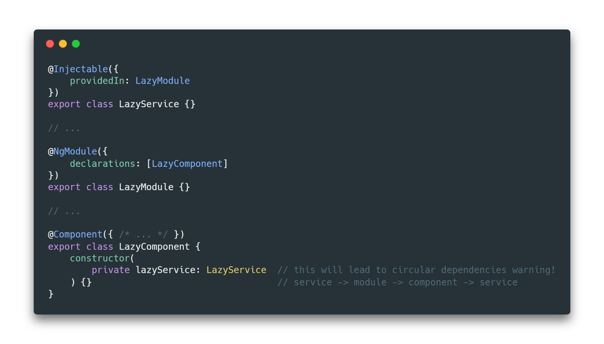

# 第二节课《依赖注入》

### 一. 什么是依赖注入，依赖注入解决了什么问题


---

### 二. 依赖注入的实现原理

#### 问题1：一个函数如何知道我的参数类型?
反射：在运行时可以获得一些对象和类型的结构信息

通过 [reflect-metadata](https://github.com/rbuckton/reflect-metadata) 可以获得

* 对象的类型
* 成员/静态属性的信息(类型)
* 方法的参数类型(design:paramtypes)、返回类型(design:returntype)

``` typescript
import 'reflect-metadata';

const logMeta = (target: any, propertyKey: string) => {
  // 获取成员类型 -> Function
  console.log(Reflect.getMetadata('design:type', target, propertyKey));
  // 获取成员参数类型 -> [String]
  console.log(Reflect.getMetadata('design:paramtypes', target, propertyKey));
  // 获取成员返回类型 -> String
  console.log(Reflect.getMetadata('design:returntype', target, propertyKey));
};


class SayHello {
  @logMeta
  hello(name: string): string {
    return `hello, ${name}`;
  }
}

```

---

### 三. Angular 依赖注入的正确使用姿势 - 定义一个服务

#### 1. `字面量`

```typescript
@NgModule({
  providers: [ServiceA]
})

// 等价于
@NgModule({
  providers: [
    provide: ServiceA, useClass: ServiceA
  ]
})
```

#### 2. `替代类`

```typescript
@NgModule({
  providers: [
    provide: ServiceA, useClass: ServiceB
  ]
})
```

#### 3. `单实例`

```typescript
@NgModule({
  providers: [
    provide: ServiceA, useExisting: ServiceB
  ]
})
```

#### 4. `值`

```typescript

const ServiceA = new InjectionToken<IServiceA>('service.a');

@NgModule({
  providers: [
    provide: ServiceA, useValue: 'i am a service'
  ]
})
```

#### 5. `工厂`

```typescript

let serviceAFactory = (b: B) => {
  return new ServiceA(b);
};

@NgModule({
  providers: [
    {
      provide: ServiceA,
      useFactory: serviceAFactory,
      deps: [B]
    }
  ]
})

```

#### 6. `内置令牌`

* PLATFORM_INITIALIZER：平台初始化之后调用的回调函数。

* APP_BOOTSTRAP_LISTENER：每个启动组件启动完成之后调用的回调函数。这个处理器函数会收到这个启动组件的 ComponentRef 实例。

* APP_INITIALIZER：应用初始化之前调用的回调函数。注册的所有初始化器都可以（可选地）返回一个 Promise。所有返回 Promise 的初始化函数都必须在应用启动之前解析完。如果任何一个初始化器失败了，该应用就不会继续启动。

---


### 四. Angular 依赖注入的正确使用姿势 - 摇树优化

```typescript
// 此时你不需要在 ngModule 里再注册了
@Injectable({
  providedIn: 'root', // 也可以是某个具体的 Module
})
export class Service {
}
```

打包策略：

1. 如果没有被使用不会被打包

2. 如果服务仅被注入到懒加载模块，它将捆绑在懒加载包中

3. 如果服务又被注入到正常模块中，它将捆绑在主包中

<br />

#### 问题1：如果依然在 ngModule 里注册会怎么样？

可能出现多个实例

#### 问题2：如果是 providedIn 是特定的 Module，那如何解决循环依赖



使用一个单独 Module 用于注册服务

---

### 五. Angular 依赖注入的正确使用姿势 - 通过 Constructor 注入服务

#### 1. 默认
按照组件树自下而上查找

#### 2. `@Self()`

只在组件本身查找

#### 3. `@Optional()`

可选依赖，找不到返回 null

#### 4. `@SkipSelf()`

跳过自身自下而上查找

#### 5. `@Host()`
自下而上，最长到达宿主组件

---

### 六. Angular 依赖注入的正确使用姿势 - 通过 Injector 注入服务

#### 1. `InjectionToken`

``` typescript
const MyServiceToken = new InjectionToken<string>('MyService');
```

#### 2. `Injector`

``` typescript
const myService = injector.get(MyServiceToken);

// 创建一个新的 Injector 实例
const injector = Injector.create({
  providers: []
});
```


---

### 七. Angular 依赖注入的正确使用姿势 - 组件的注入


#### ElementRef: 注入自身 DOM 元素


#### 使用 forwardRef 来打破循环引用


---

#### 参考资料

[Angular2的依赖注入是怎么实现的？](https://www.zhihu.com/question/265773703/answer/299346644)

[从 JavaScript 到 TypeScript 4 - 装饰器和反射](https://segmentfault.com/a/1190000011520817)

[@Self or @Optional @Host? The visual guide to Angular DI decorators.](https://medium.com/frontend-coach/self-or-optional-host-the-visual-guide-to-angular-di-decorators-73fbbb5c8658)