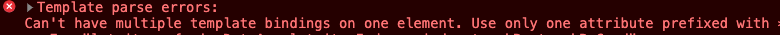

# 第 1 节：什么是指令
作为指令章节中的第一小节，我们还是有必要说一下，什么是指令。

指令其实就是一种执行信号，一旦发布了这条指令，就要执行对应的动作。Angular 中的指令我们可以简单的理解为让特定的 DOM 元素执行相应的函数。正如我们知道的那样， Anuglar 的模板是动态的，当渲染它们的时候，会根据指令给出的指示对 DOM 进行转换。指令是个带有 @Directive() 装饰器的类。指令还具有可以扩展元素的功能的作，说白了，一个指令的本质就是是模板中出现的特殊标记，让处理模板的库知道需要对这里的 DOM 元素进行一些对应的处理。指令的内部实现上用了 Object.defineProperty 对属性进行了拦截。

在下一个章节中要讲的组件从技术上讲也是指令，但是由于组件对 Angular 应用非常特殊，又特别重要。因此，Angular 专门定义了 @Component() 装饰器，它使用一些面向模板的特性扩展了 @Directive() 装饰器。
在 Angular 中一共拥有三种指令：
  * 组件--拥有模板的指令。
  * 结构型指令--通过添加和移除DOM元素改变DOM布局的指令，例如 NgFor 和 NgIf。
  * 属性型指令--改变元素、组件或其它指令的外观和行为的指令，例如内置的 NgStyle 指令可以同时修改元素的多个样式。

接下来，让我们详细的了解一下他们。
### 1.1 什么是结构型指令？

结构型指令的职责是 HTML 布局。 它们塑造或重塑 DOM 的结构，比如添加、移除或维护这些元素。

像其它指令一样，你可以把结构型指令应用到一个宿主元素上。 然后它就可以对宿主元素及其子元素做点什么。

### 1.2 微语法
Angular 微语法可以通过简短的、友好的字符串来配置一个指令，微语法解析器把这个字符串翻译成 <ng-template> 上的属性。
在下面这个例子中，星号（*）被放在指令的属性名之前

    
{{car.id}}

你可能注意到了，*ngIf 被设置成了一个字符串，并没有使用 [] 或者 () ，这其实是星号(
*)简写方法。 Angular 会解开这个语法糖，变成一个 <ng-template>标记，包裹着宿主元素及其子元素，每个结构指令都可以用这个模板做点不同的事情。
在上面的例子上，Angular 将代码翻译成了

    <ng-template [ngIf]="car">
      
{{car.id}}

    </ng-template>

- *ngIf 指令被移到了 <ng-template> 元素上，在那里，它变成了一个属性绑定 [ngIf]。
- 
 上其余部分，包括 class 在内，移到了内部的 <ng-template> 元素上。

### 1.3 为什么每个宿主元素上只能拥有一个宿主指令？

开发过程中，我们可以在一个宿主元素上使用多个属性型指令，这没有问题，但是只能使用一个结构型指令，这是为什么呢？

我们来实际的举个例子，在 <ul> 中使用 *ngFor 来循环一个 <li> 列表，这个时候，我们有想要使用 *ngIf 来判断在某些条件下对应的 item 是否出现，在这个时候，如果我们把 *ngFor 与 * ngIf 同时放到 <li> 上会遭到 Angular 的拒绝。
  
因为结构型指令可能会对宿主元素及其子元素做很复杂的事情，当这两个指令放到同一个元素的时候，Angular 并不知道如何将这个能力泛化，以取消其它结构性指令的效果，禁止多个结构型指令可以很简单的解决这些问题。 像是我们上面遇到的这种情况，可以在 <ng-container> 上放置 *ngIf 指令，然后包装进 *ngFor 元素中。 <ng-container> 是一个分组元素，Angular 压根不会把它放到 DOM 中，所以不会污染样式和元素布局。

### 1.4 结构型指令是怎么做到控制 DOM 结构的呢？

在编写结构型指令的时候，我们会导入 `TemplateRef` 和 `ViewContainerRef` 。可以通过使用 `TemplateRef` 来取得<ng-template> 的内容， 并通过 `ViewContainerRef` 来访问这个视图容器。

接下来，让我们详细讲一下 `TemplateRef` 与 `ViewContainerRef。`

1. **TemplateRef**

  `TemplateRef` 表示一个内嵌模板，可以用来实例化内嵌的视图。通过把一个指令放在 <ng-template> 元素（或者一个带 * 前缀的指令）上，可以访问 TemplateRef 的实例，内前视图的 TemplateRef 实例会以 TemplateRef 作为令牌，注入到该指令的构造函数中。

  如果你想要根据模板实例化内嵌内容，需要使用到 ViewContainerRef 的 createEmbeddedView() 方法。这个方法的作用是创建一个视图对象，并把它附着到父视图的视图容器上，接受一个context 参数用于承接新视图的上下文环境，继承自所附着的元素，该方法返回新的视图对象。

      abstract createEmbeddedView(context: C): EmbeddedViewRef<C>
2. **ViewContainerRef**

  `ViewContainerRef` 表示可以将一个或多个视图附着到组件中的容器。可以包含宿主容器（当用 createComponent()方法实例化组件时创建）和内联视图（当用 createEmbeddedView()方法实例化 TemplateRef 时创建）。

  `ViewContainerRef` 拥有多个方法，比如： clear()， get()， createEmbeddedView()， createComponent()， insert()， move()， indexOf()， remove()， detach()。 让我们来重点介绍一下createEmbeddedView() 和 createComponent() 方法。

  **createEmbeddedView()** 这个方法实例化一个内嵌视图，并把它插入到该容器中，注意，它与 insert()方法是不同的， insert() 方法是将一个视图插入到当前容器中。 createEmbeddedView() 接受三个参数:templateRef 用来定义视图的 HTML 模板，context 是一个可选参数，默认为 undefined，最后一个参数是 index，同样是可选参数，是一个从0开始的索引，用来表示新视图要插入当前容器的哪个位置，如果没有指定就会插入到最后，默认值为 undefined。这个方法返回新创建的 这个视图的 viewRef 实例。

      abstract createEmbeddedView<C>(templateRef: TemplateRef<C>, context?: C, index?: number): EmbeddedViewRef<C>

  接着让我们再说一下 createComponent() 方法，它与**createEmbeddedView()** 功能很相似，不过它是实例化的是 Component并把它的宿主视图插入到该容器中。它的参数有点多，我们来看一下下面的表格来了解一下。

  | 参数 | 类型 | 描述 |
  | :----: | :----: | :----: |
  | componentFactory | ComponentFactory | 要使用的工厂 |
  | index | number | 一个从0开始的索引，与createEmbeddedView() 中的 index 类似，不赘述 |
  | injector | Injector | 一个注入器，将用作新组建的父注入器， 可选. 默认值是 undefined. | 
  | projectableNodes | any[][] | 可选. 默认值是 undefined. |
  | ngModule | NgModuleRef | 可选. 默认值是 undefined. |

  该方法返回新组建的实例，包含宿主视图。

      abstract createComponent<C>(componentFactory: ComponentFactory<C>, index?: number, injector?: Injector, projectableNodes?: any[][], ngModule?: NgModuleRef<any>): ComponentRef<C>