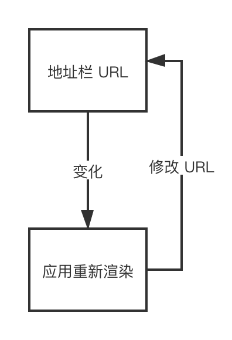

# 第 4 节：路由的实现

实际上要实现一个简单的前端路由并不复杂，想想整个流程大概是什么样的



我们至少需要做两件事

1. 需要监听地址栏里 URL 的变化，重新渲染应用
2. 修改地址栏里的 URL

### 4.1 使用 hash 实现

**修改 hash**

    window.location.hash = 'new-page'；

**监听 hash 的变化**

    window.addEventListener('hashchange', () => {
      console.log('重新渲染应用');
    }, false);

### 4.2 使用 history 实现

**修改 history state**

    history.pushState({page: 1}, "new page title1", "new-page-1");
    history.replaceState({page: 2}, "new page title2", "new-page-2");

**监听 hash 的变化**

    window.addEventListener('popstate', (event) => {
      console.log('重新渲染应用');
    });

### 4.3 路由指令的实现

#### 4.3.1 `<router-link>` , `<router-link-with-href>`

源码：[https://github.com/angular/angular/blob/master/packages/router/src/directives/router_link.ts#L161](https://github.com/angular/angular/blob/master/packages/router/src/directives/router_link.ts#L161)

核心代码如下，可以看到其实这两个指令是编程式导航的语法糖

``` typescript
// ...
@HostListener('click')
  onClick(): boolean {
    // ...
    this.router.navigateByUrl(this.urlTree, extras);
    // ...
  }
// ...
```

#### 4.3.2 `<router-link-active>`

源码：[https://github.com/angular/angular/blob/master/packages/router/src/directives/router_link_active.ts](https://github.com/angular/angular/blob/master/packages/router/src/directives/router_link_active.ts)
``` typescript
/**
  *
  * 当路由匹配到 ·/user 或 /user/bob，对应的类将会添加在 a 标签上，反之则移除
  *
  * ```
  * <a routerLink="/user/bob" routerLinkActive="class1 class2">Bob</a>
  * <a routerLink="/user/bob" [routerLinkActive]="['class1', 'class2']">Bob</a>
  * ```
  *
  * 你可以添加 routerLinkActiveOptions 的 exact 参数，如果你想要精确匹配的话，默认不是
  *
  * ```
  * <a routerLink="/user/bob" routerLinkActive="active-link" [routerLinkActiveOptions]="{exact:
  * true}">Bob</a>
  * ```
  *
  * 你也可以通过模板上下文直接获取到是否激活的状态，用于做一些特殊的展示
  * ```
  * <a routerLink="/user/bob" routerLinkActive #rla="routerLinkActive">
  *   Bob {{ rla.isActive ? '(already open)' : ''}}
  * </a>
  * ```
  *
  * 也可以将 routerLinkActive 用于 routerLink 的祖先，这样任意命中一个 routerLink 即可激活
  *
  * ```
  * <div routerLinkActive="active-link" [routerLinkActiveOptions]="{exact: true}">
  *   <a routerLink="/user/jim">Jim</a>
  *   <a routerLink="/user/bob">Bob</a>
  * </div>
  * ```
  */
@Directive({
  selector: '[routerLinkActive]',
  exportAs: 'routerLinkActive',
})
export class RouterLinkActive implements OnChanges, OnDestroy, AfterContentInit {
  @ContentChildren(RouterLink, {descendants: true})
  links !: QueryList<RouterLink>;
  @ContentChildren(RouterLinkWithHref, {descendants: true})
  linksWithHrefs !: QueryList<RouterLinkWithHref>;
  
  private classes: string[] = [];
  private subscription: Subscription;
  // 用于外部获取的一个只读属性
  public readonly isActive: boolean = false;

  @Input() routerLinkActiveOptions: {exact: boolean} = {exact: false};

  constructor(
      private router: Router, private element: ElementRef, private renderer: Renderer2,
      @Optional() private link?: RouterLink,
      @Optional() private linkWithHref?: RouterLinkWithHref) {
    this.subscription = router.events.subscribe((s: Event) => {
      // 当路由更新时触发一次检查
      if (s instanceof NavigationEnd) {
        this.update();
      }
    });
  }


  ngAfterContentInit(): void {
    // 当投影更新时候触发一次检查
    this.links.changes.subscribe(_ => this.update());
    this.linksWithHrefs.changes.subscribe(_ => this.update());
    this.update();
  }

  @Input()
  set routerLinkActive(data: string[]|string) {
    const classes = Array.isArray(data) ? data : data.split(' ');
    this.classes = classes.filter(c => !!c);
  }

  // 当属性更改时触发一次检查
  ngOnChanges(changes: SimpleChanges): void { this.update(); }
  ngOnDestroy(): void { this.subscription.unsubscribe(); }

  private update(): void {
    if (!this.links || !this.linksWithHrefs || !this.router.navigated) return;
    Promise.resolve().then(() => {
      const hasActiveLinks = this.hasActiveLinks();
      if (this.isActive !== hasActiveLinks) {
        (this as any).isActive = hasActiveLinks;
        // 添加和移除 class
        this.classes.forEach((c) => {
          if (hasActiveLinks) {
            this.renderer.addClass(this.element.nativeElement, c);
          } else {
            this.renderer.removeClass(this.element.nativeElement, c);
          }
        });
      }
    });
  }

  // 返回一个函数，用于判断路由是否命中
  private isLinkActive(router: Router): (link: (RouterLink|RouterLinkWithHref)) => boolean {
    return (link: RouterLink | RouterLinkWithHref) =>
                router.isActive(link.urlTree, this.routerLinkActiveOptions.exact);
  }

  // 检查是否有命中路由
  private hasActiveLinks(): boolean {
    const isActiveCheckFn = this.isLinkActive(this.router);
      return
        // 检查自身是否被命中
        this.link && isActiveCheckFn(this.link) ||
        this.linkWithHref && isActiveCheckFn(this.linkWithHref) ||
        // 检查投影里的路由链接是否有被命中
        this.links.some(isActiveCheckFn) ||
        this.linksWithHrefs.some(isActiveCheckFn);
  }
}
```

#### 4.3.3 `<router-outlet>`