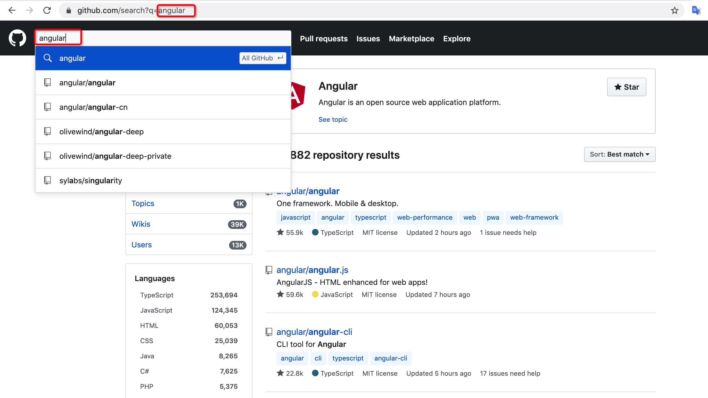

# 第 5 节：路由组织最佳实践

### 5.1 **路由地址的组织**

在路由组织的实践上，恐怕没有比 GitHub 做得更好的了，观察其路由组织，我们可以发现一些规律

1. **路由是和业务吻合且自解释的**

    `xx/issues`  表示某个仓库的 issuse 列表

    `xx/issues/id` 表示某个仓库下的某个具体 issue

    `xx/issues/new` 表示在某个仓库下的创建一个新 issue

    通常大家喜欢把‘创建’资源的路由单独拆成如 `xx/create-issue`，实际上这是没有必要的，它增加了我们路由的长度，而类似 Github 这种通过检查 id 是否是 ‘new’ 来选择显示内容的路由组织方式是对用户是更友好的。 

2. **路由是及时更新的**

    你现在可以打开 Github 官网，然后尝试在搜索框输入一些关键词，观察浏览器地址栏的变化

    

    在 Github 中你的大部分操作都会反应在 URL 的 query 中，这就意味着你可以随时将你的网址收藏或者分享给别人，Github 会帮你还原到准确位置上去，这对于用户是有较大价值的。

### 5.2 自解释的目录结构

基于上述规律我们可以将其映射到 Angular 的路由模块上

    const routes: Routes = [
      {
    		path: 'issues',
    		component: ListIssuesComponent，
    	},
      {
    		path: 'issues/new',
    		component: NewIssueComponent，
    	},
      {
    		path: 'issues/:id',
    		component: ViewIssueComponent，
    	},
    ];

### 5.3 部署到生产环境

默认的 Angular 路由是基于 history 模式，也就是说在生产环境中如果你直接访问 `[www.exmaple.com/angular-router](http://www.exmaple.com/angular-router)` 将会访问到一个 404 页面，原因是在服务器上并没有对应资源，而 Angular 的路由模块是用于处理前端路由的，因此我们需要对服务器的配置稍作修改，以 nginx 为例

    server {
        listen 80;
        server_name  localhost;
        root /web/dist/;
        index  index.html;
        # 如果找不到对应资源的话就返回 index.html，将路由控制权交给前端
        location / {
            index  index.html index.htm;
            try_files $uri $uri/ /index.html;
        }
    		# ...
    }

还有一种更简单的部署方式就是开始 hash 模式，这种模式下我们无需修改服务器配置

    @NgModule({
      imports: [
        RouterModule.forRoot(
          routes,
    	    {
    		    useHash: true,
          }
        )],
      exports: [RouterModule],
    })
    export class RouteRoutingModule { }